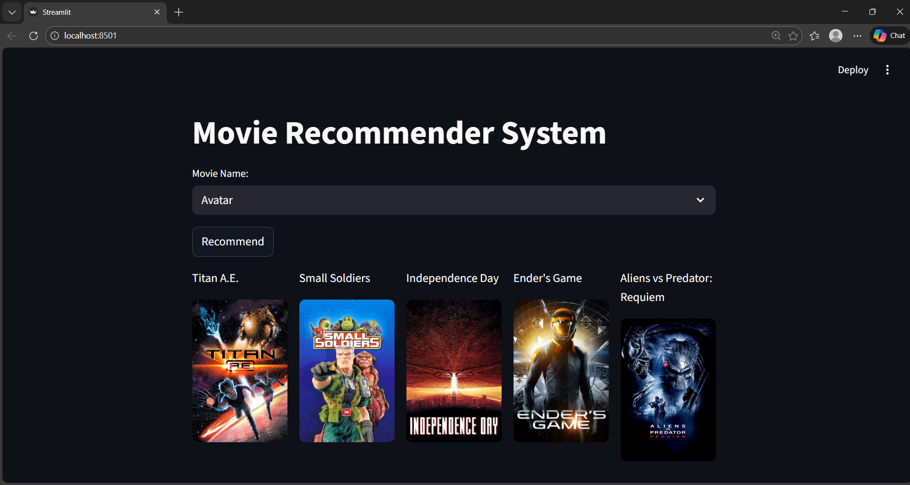

# Movie Recommender System

A content-based movie recommendation system built with Python, Streamlit, and machine learning techniques. The system recommends movies based on similarity scores calculated from movie metadata such as genres, keywords, cast, and crew.

## 🎬 Features

- **Content-Based Filtering**: Recommends movies based on similarity in content (genres, keywords, cast, director)
- **Interactive Web Interface**: User-friendly Streamlit application
- **Movie Posters**: Displays movie posters using TMDB API
- **Real-time Recommendations**: Instant recommendations for any movie in the dataset
- **Visual Display**: Shows 5 recommended movies in a clean column layout

## 🛠️ Tech Stack

- **Python**: Core programming language
- **Pandas**: Data manipulation and analysis
- **NumPy**: Numerical computations
- **Scikit-learn**: Machine learning and text processing
- **Streamlit**: Web application framework
- **TMDB API**: Movie poster fetching
- **Pickle**: Model and data serialization

## 📊 Dataset

The system uses the TMDB 5000 Movie Dataset:
- **tmdb_5000_movies.csv**: Contains movie information (title, genres, keywords, overview, etc.)
- **tmdb_5000_credits.csv**: Contains cast and crew information
- **Total Movies**: ~4800 movies
- **Features Used**: Genres, keywords, cast, director, overview

## 🚀 Installation & Setup

### Prerequisites

- Python 3.8+
- Git

### Steps

1. **Clone the repository**
   ```bash
   git clone https://github.com/Code-With-Samuel/Movie-Recommendation-System.git
   cd Movie-Recommendation-System
   ```

2. **Create and activate virtual environment**
   ```bash
   python -m venv .venv
   # On Windows
   .venv\Scripts\activate
   # On macOS/Linux
   source .venv/bin/activate
   ```

3. **Install dependencies**
   ```bash
   pip install -r requirements.txt
   ```

4. **Run the application**
   ```bash
   streamlit run app.py
   ```

## 📁 Project Structure

```
Movie-Recommendation-System/
├── app.py                    # Main Streamlit application
├── movie-recommender-system.ipynb  # Jupyter notebook with data processing
├── movies.pkl                # Processed movies data
├── movie_dict.pkl            # Movie dictionary for quick lookup
├── similarity.pkl            # Cosine similarity matrix
├── tmdb_5000_movies.csv     # Raw movies dataset
├── tmdb_5000_credits.csv   # Raw credits dataset
├── requirements.txt          # Python dependencies
├── images/
│   └── image.png           # Application screenshot
└── README.md               # This file
```

## 🧠 How It Works

### 1. Data Preprocessing
- Loads movies and credits datasets
- Merges datasets on movie titles
- Extracts and cleans features:
  - Genres (top 3)
  - Keywords (top 3)
  - Cast (top 3 actors)
  - Director
  - Overview

### 2. Feature Engineering
- Combines all text features into tags
- Applies text preprocessing:
  - Lowercase conversion
  - Stop word removal
  - Stemming

### 3. Similarity Calculation
- Uses TF-IDF Vectorizer to convert text to numerical vectors
- Calculates cosine similarity between all movie pairs
- Stores similarity matrix for fast lookup

### 4. Recommendation Logic
- Takes user-selected movie
- Finds similarity scores with all other movies
- Sorts by similarity (descending)
- Returns top 5 most similar movies (excluding the input movie)

### 5. Web Interface
- Streamlit provides interactive UI
- Dropdown for movie selection
- Displays recommendations with posters
- Uses TMDB API to fetch movie posters

## 🖥️ Application Preview



The application features:
- **Movie Selection Dropdown**: Choose from ~4800 movies
- **Recommend Button**: Get instant recommendations
- **Visual Display**: 5-column layout showing movie titles and posters
- **Responsive Design**: Works on desktop and mobile devices

## 📈 Performance

- **Dataset Size**: ~4800 movies
- **Features Used**: 5000+ text features after TF-IDF
- **Similarity Matrix**: 4800×4800 cosine similarity matrix
- **Response Time**: <1 second for recommendations
- **Memory Usage**: ~200MB (mainly similarity matrix)

## 🔧 Configuration

### TMDB API Setup
To use movie posters, you need a TMDB API key:

1. Sign up at [TMDB](https://www.themoviedb.org/signup)
2. Get your API key from [Settings > API](https://www.themoviedb.org/settings/api)
3. Replace the API key in `app.py` line 7:
   ```python
   response= requests.get('https://api.themoviedb.org/3/movie/{}?api_key=YOUR_API_KEY&language=en-US'.format(movie_id))
   ```

## 🐛 Troubleshooting

### Common Issues

1. **Large File Error**: If you encounter Git LFS issues:
   ```bash
   git lfs install
   git lfs track "*.pkl"
   git add .gitattributes
   git add *.pkl
   git commit -m "Add LFS tracking"
   git push
   ```

2. **Missing Dependencies**: Ensure all packages are installed:
   ```bash
   pip install streamlit pandas numpy scikit-learn requests
   ```

3. **API Key Issues**: Verify your TMDB API key is valid and has sufficient quota

4. **Memory Issues**: The similarity matrix is large (~200MB). Ensure sufficient RAM is available.

## 🤝 Contributing

Contributions are welcome! Please feel free to submit a Pull Request. For major changes, please open an issue first to discuss what you would like to change.

### Development Setup

1. Fork the repository
2. Create a feature branch
3. Make your changes
4. Test thoroughly
5. Submit a pull request

## 📄 License

This project is licensed under the MIT License - see the [LICENSE](LICENSE) file for details.

## 🙏 Acknowledgments

- **TMDB** for providing the movie dataset and API
- **Scikit-learn** for machine learning tools
- **Streamlit** for the web framework
- **Pandas** for data manipulation

## 📞 Contact

Created by [Code-With-Samuel](https://github.com/Code-With-Samuel)

If you have any questions or suggestions, feel free to:
- Open an issue on GitHub
- Reach out via the repository discussions

---

**⭐ If you find this project helpful, please give it a star!**